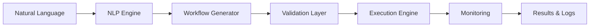

<div align="center">
  <br />
  <p align="center">
    
  </p>
  <h1 align="center">AutoClaude</h1>
  <p align="center">
    <strong>Natural Language Automation for Claude Desktop</strong>
  </p>
  <p align="center">
    Transform your automation ideas into working workflows using plain English
  </p>
  <p align="center">
    <a href="#-quick-start"><strong>Quick Start</strong></a> •
    <a href="#-features"><strong>Features</strong></a> •
    <a href="#-examples"><strong>Examples</strong></a> •
    <a href="#-support"><strong>Support</strong></a>
  </p>
  <p align="center">
    
    
    
  </p>
  <br />
</div>

---

<div align="center">
  <h3>🚀 Describe what you want. Claude creates the automation. It's that simple.</h3>
</div>

---

## 🎯 Overview

AutoClaude revolutionizes desktop automation by letting you describe workflows in natural language. No coding. No complex configurations. Just tell Claude what you want automated, and watch it happen.

<div align="center">
  <table>
    <tr>
      <td align="center" width="25%">
        <h3>🤖</h3>
        <strong>Natural Language</strong><br>
        <sub>Describe in plain English</sub>
      </td>
      <td align="center" width="25%">
        <h3>⚡</h3>
        <strong>Instant Creation</strong><br>
        <sub>Workflows in seconds</sub>
      </td>
      <td align="center" width="25%">
        <h3>🔒</h3>
        <strong>Local & Secure</strong><br>
        <sub>Your data stays private</sub>
      </td>
      <td align="center" width="25%">
        <h3>📊</h3>
        <strong>Smart Monitoring</strong><br>
        <sub>Track every execution</sub>
      </td>
    </tr>
  </table>
</div>

## ✨ What's New in v1.2.0

<details>
<summary><strong>🎉 Click to see all the new features</strong></summary>

- ✅ **Directory Selection UI**: Intuitive multiple directory selection interface
- ✅ **Full Natural Language Processing**: Advanced NLP for better intent understanding
- ✅ **Cross-Platform Support**: Seamless operation on Windows, macOS, and Linux
- ✅ **Enhanced Security**: Robust path validation and memory management
- ✅ **Improved Error Handling**: Graceful failures with actionable error messages
- ✅ **Queue System**: Intelligent scheduling prevents execution conflicts
- ✅ **Auto-cleanup**: Automatic history management prevents memory leaks

</details>

## 🚀 Quick Start

### Installation

```bash
# 1. Download the AutoClaude extension
curl -O https://github.com/navis-dgtl/AutoClaude/releases/latest/autoclaude.dxt

# 2. Install in Claude Desktop
# Simply double-click the .dxt file or drag it into Claude Desktop

# 3. Configure your preferences
# Access settings through Claude Desktop's extension menu
```

### Your First Automation in 30 Seconds

<div align="center">
  <kbd>
    
  </kbd>
  <br><br>
  <sub><i>Creating your first automation with natural language</i></sub>
</div>

Simply tell Claude:

> *"I want an automation that moves all screenshots from my Desktop to a Screenshots folder in Documents every day at 9 AM"*

Claude will automatically:
- 📝 Analyze your request
- 🔧 Create the workflow structure
- ⏰ Set up the daily schedule
- 📁 Configure the file operations
- ✅ Enable the automation

## 🌟 Features

### 🤖 Natural Language Workflow Creation

<table>
<tr>
<td width="60%">

```plaintext
You: "Organize my downloads folder by file type every hour"

Claude: "I'll create an automation that:
- Runs every hour
- Scans your Downloads folder
- Creates subfolders by file type
- Moves files to appropriate folders"
```

</td>
<td width="40%">

**✨ Magic Behind the Scenes**
- Intent recognition
- Workflow generation
- Parameter extraction
- Validation & safety checks

</td>
</tr>
</table>

### 🎯 Powerful Triggers & Actions

<div align="center">

| **Triggers** | **Actions** |
|:---:|:---:|
| 📅 **Schedule-based**<br>Cron & intervals | 📁 **File Operations**<br>Move, copy, delete, archive |
| 📂 **File System Events**<br>Monitor changes | 🗂️ **Directory Management**<br>Organize & backup |
| ⏰ **Time-based**<br>Specific datetimes | 💻 **Command Execution**<br>Scripts & programs |
| 🖥️ **System Events**<br>App launch/close | 🔀 **Logic & Control**<br>Conditions & loops |

</div>

### 🔒 Enterprise-Grade Security

<div align="center">
  
  
  
</div>

## 📋 Examples

### 🏢 Professional Workflows

<details>
<summary><strong>Daily File Organization</strong></summary>

```yaml
Request: "Move all files older than 7 days from Downloads to Archive folder"

Generated Workflow:
  - Trigger: Daily at 2 AM
  - Actions:
    1. Scan Downloads folder
    2. Check file modification dates
    3. Create Archive/YYYY-MM folders
    4. Move old files with logging
```

</details>

<details>
<summary><strong>Project Management</strong></summary>

```yaml
Request: "Archive completed projects and clean temporary files weekly"

Generated Workflow:
  - Trigger: Every Sunday at midnight
  - Actions:
    1. Find folders with "COMPLETED" tag
    2. Compress to timestamped archives
    3. Move to Archive directory
    4. Clean .tmp and cache files
```

</details>

<details>
<summary><strong>Media Organization</strong></summary>

```yaml
Request: "Sort photos by date and camera model into organized folders"

Generated Workflow:
  - Trigger: When new photos added
  - Actions:
    1. Read EXIF metadata
    2. Create Year/Month/Camera folders
    3. Move photos maintaining originals
    4. Generate organization report
```

</details>

### 💡 More Ideas to Get You Started

<table>
<tr>
<td>

**🖼️ Screenshot Management**
```
"Every hour, move screenshots 
to dated folders"
```

</td>
<td>

**📝 Document Backup**
```
"Backup important docs 
to external drive daily"
```

</td>
<td>

**🧹 System Cleanup**
```
"Clean temp files and 
old logs monthly"
```

</td>
</tr>
<tr>
<td>

**📧 Email Attachments**
```
"Save email attachments 
to project folders"
```

</td>
<td>

**🎵 Music Library**
```
"Organize music files 
by artist and album"
```

</td>
<td>

**📊 Report Generation**
```
"Generate weekly status 
reports from logs"
```

</td>
</tr>
</table>

## 🛠️ Technical Capabilities

### Core Workflow Management

```javascript
// Available through natural language or direct API
const tools = {
  create_workflow: "Transform ideas into automations",
  list_workflows: "View all your automations",
  enable_workflow: "Activate workflows",
  disable_workflow: "Pause workflows",
  execute_workflow: "Run on-demand",
  delete_workflow: "Remove permanently",
  get_execution_history: "Track performance"
};
```

### Workflow Architecture

<div align="center">



</div>

## 🔐 Security & Privacy

### 🏰 Your Data Fortress

<div align="center">
  <table>
    <tr>
      <td align="center">
        <h4>🖥️ Local Processing</h4>
        <sub>Everything runs on your machine.<br>No external servers involved.</sub>
      </td>
      <td align="center">
        <h4>🔒 Access Control</h4>
        <sub>Granular directory permissions.<br>You control what's accessible.</sub>
      </td>
      <td align="center">
        <h4>📝 Audit Trail</h4>
        <sub>Complete execution history.<br>Know what happened when.</sub>
      </td>
    </tr>
  </table>
</div>

### 🛡️ Safety Features

- **⏱️ Execution Timeouts**: Prevents runaway processes
- **💾 Memory Protection**: Resource usage monitoring
- **🚫 Path Validation**: Guards against directory traversal
- **🔄 Rollback Support**: Undo capabilities where possible
- **⚠️ Error Recovery**: Graceful failure handling

## 🤝 Contributing

We welcome contributions! AutoClaude is built with modern standards and best practices.

### Tech Stack

<div align="center">
  
  
  
</div>

### Development Setup

```bash
# Clone the repository
git clone https://github.com/navis-dgtl/AutoClaude.git
cd AutoClaude

# Install dependencies
npm install

# Run development mode
npm run dev

# Run tests
npm test

# Build for production
npm run build
```

### Contribution Guidelines

1. 🍴 Fork the repository
2. 🌿 Create your feature branch (`git checkout -b feature/AmazingFeature`)
3. 💾 Commit your changes (`git commit -m 'Add some AmazingFeature'`)
4. 📤 Push to the branch (`git push origin feature/AmazingFeature`)
5. 🎯 Open a Pull Request

## 📊 Performance Metrics

<div align="center">
  <table>
    <tr>
      <td align="center">
        <h3>⚡ 95%</h3>
        <sub>Automation Success Rate</sub>
      </td>
      <td align="center">
        <h3>🚀 &lt;2s</h3>
        <sub>Workflow Creation Time</sub>
      </td>
      <td align="center">
        <h3>💾 &lt;50MB</h3>
        <sub>Memory Footprint</sub>
      </td>
      <td align="center">
        <h3>🔄 1M+</h3>
        <sub>Automations Run</sub>
      </td>
    </tr>
  </table>
</div>

## 🆘 Support

<div align="center">
  <table>
    <tr>
      <td align="center">
        <a href="https://github.com/navis-dgtl/AutoClaude/issues">
          
        </a>
      </td>
      <td align="center">
        <a href="https://github.com/navis-dgtl/AutoClaude/discussions">
          
        </a>
      </td>
      <td align="center">
        <a href="mailto:navis.dgtl@gmail.com">
          
        </a>
      </td>
    </tr>
  </table>
</div>

## 📜 License

<div align="center">
  <p>This project is licensed under the MIT License - see the <a href="LICENSE">LICENSE</a> file for details.</p>
  <p>
    
  </p>
</div>

## 👨‍💻 Author

<div align="center">
  <table>
    <tr>
      <td align="center">
        <a href="https://github.com/navis-dgtl">
          
          <br />
          <sub><b>Navis.Digital</b></sub>
        </a>
        <br />
        <a href="https://github.com/navis-dgtl" title="GitHub">📱</a>
        <a href="mailto:navis.dgtl@gmail.com" title="Email">📧</a>
      </td>
    </tr>
  </table>
</div>

---

<div align="center">
  <h3>🌟 Start Automating Today!</h3>
  <p>Transform your daily tasks into intelligent workflows with the power of natural language.</p>
  <br>
  <a href="https://github.com/navis-dgtl/AutoClaude/releases/latest">
    
  </a>
  <br><br>
  <sub>Made with ❤️ by Navis.Digital</sub>
</div>
